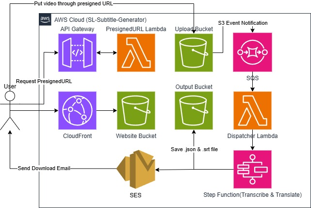
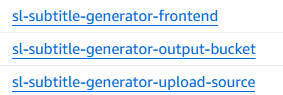
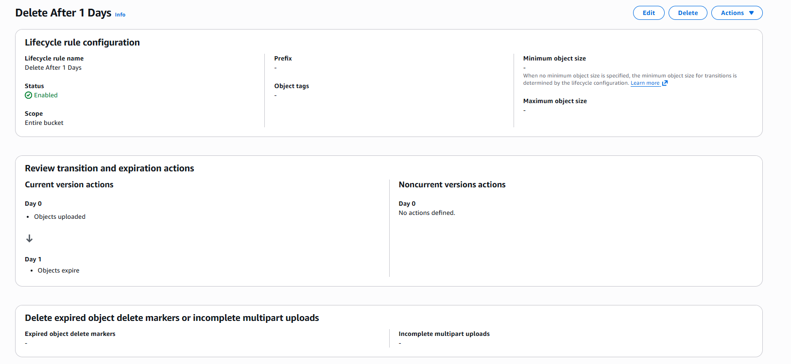
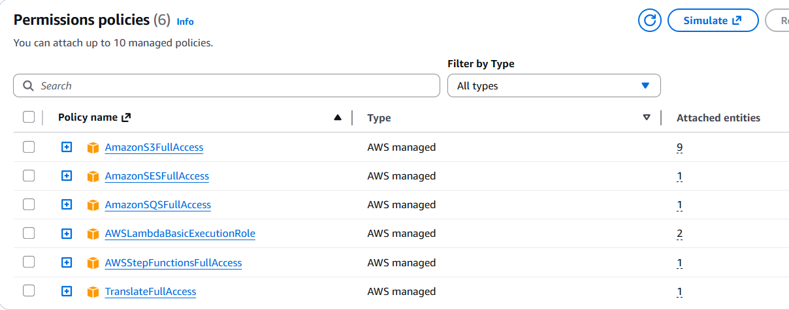
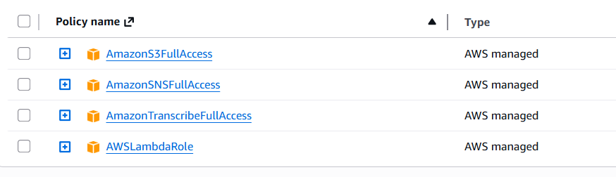

# SL-Subtitle-Generator 🎬


> A fun, 100% serverless, event-driven AI subtitle generation and translation pipeline built natively on AWS.

## 🏗️ Architecture Topology




## 🎥 Demo Video

**Video walkthrough placeholder:** Console-based deployment and end-to-end workflow demo.


## ✨ Technical Highlights & Design Patterns

This project was built with a strong focus on security, scalability, and FinOps best practices:

* **Zero-Trust Frontend Delivery**: Static website hosted on S3 and delivered globally via **CloudFront**, strictly secured with **Origin Access Control (OAC)** to block direct public access.
* **Presigned URL Direct Uploads**: Utilizes **API Gateway + Lambda** to dynamically issue S3 Presigned URLs. This bypasses API payload limits, reduces compute overhead, and implements **Idempotent Job Generation** via UUIDs to prevent naming collisions.
* **Event-Driven Decoupling**: Implements **Amazon SQS** as an asynchronous buffer between S3 upload events and backend processing, effectively smoothing out traffic spikes and preventing downstream API throttling.
* **Microservices Orchestration**: Uses **AWS Step Functions** to orchestrate complex, multi-step asynchronous AI tasks, integrating **Amazon Transcribe** and **Amazon Translate** with built-in error handling and dynamic routing.
* **Strict Least Privilege**: All IAM Roles are meticulously scoped down using IAM Access Advisor to adhere to the Principle of Least Privilege.
* **Automated FinOps**: S3 Lifecycle Rules automatically purge processed videos and subtitles after 24 hours to optimize storage costs.

## 🗂️ Repository Structure

```
/sl-subtitle-generator
├── /src
│   ├── /lambda
│   │   ├── PresignedURL_function.py      # Generates secure S3 presigned URLs with UUID-based naming
│   │   ├── dispatcher_function.py        # Parses S3 upload events from SQS and triggers Step Functions
│   │   ├── translate_function.py         # Translates transcribed text to target language using Amazon Translate
│   │   ├── format_function.py            # Formats subtitles into SRT format with intelligent line breaking
│   │   └── SES_function.py               # Sends email notifications with presigned subtitle download links
│   ├── /website
│   │   └── index.html                    # CloudFront-hosted UI
│   └── /stepfunction
│       └── sl-subtitle-generator-step-function.yaml
├── /docs
│   ├── SL-Subtitle-Generator-Diagram_v3.jpg
│   └── stepfunctions_graph.png
└── README.md
```

## 🚀 Core AWS Services Utilized

- **Compute & Orchestration**: AWS Lambda, AWS Step Functions
- **Storage & Delivery**: Amazon S3, Amazon CloudFront
- **Integration & Messaging**: Amazon API Gateway, Amazon SQS, Amazon SNS, Amazon SES
- **Machine Learning**: Amazon Transcribe, Amazon Translate
- **Security & Identity**: AWS IAM

## 🛠️ Setup & Deployment

### Prerequisites

- AWS account with Administrator or equivalent full access for learning purposes
- Web browser with access to the AWS Console
- Local copy of this repository available for uploading Lambda code and Step Function definition

### Console-Based Deployment Steps

The following guide uses the AWS Console so new users can explore each service visually.

#### 1. Create S3 Buckets

1. Open the AWS Console and go to **S3**.
2. Click **Create bucket**.
3. Create three buckets:
   - `subtitle-generator-input-<your-account-id>`
   - `subtitle-generator-output-<your-account-id>`
   - `subtitle-generator-website-<your-account-id>`
4. For each bucket, enable **Block all public access** and click **Create bucket**.

**Screenshot: S3 create bucket**



#### 2. Configure S3 Lifecycle Rules

1. Open the input bucket in S3.
2. Go to the **Management** tab.
3. Click **Create lifecycle rule**.
4. Name the rule `DeleteProcessedFiles`.
5. Choose **Apply to all objects in the bucket**.
6. In **Lifecycle rule actions**, enable **Expire current versions of objects.**
7. Set the expire day to 1.
8. Save the rule.
9. Repeat the same lifecycle rule setup in the output bucket.

**Screenshot: S3 lifecycle rule**



#### 3. Create IAM Roles

##### 🦸‍♂️ Role 1: Lambda Role (`Subtitle-Generator-Lambda-Role`)

1. Go to **IAM > Roles** and click **Create role**.
2. Select **AWS Service** as Trusted Entity Type and choose "**Lambda --> Lambda** as the use case.
3. Search for and attach these 6 managed policies:

   | Policy | Purpose |
   |--------|---------|
   | `AWSLambdaBasicExecutionRole` | **Required!** Allows Lambda to write logs to CloudWatch (essential for debugging) |
   | `AmazonS3FullAccess` | Read and write access to all S3 buckets |
   | `AmazonSQSFullAccess` | Send, receive, and delete messages from SQS queues |
   | `AWSStepFunctionsFullAccess` | Start and manage Step Functions workflows |
   | `TranslateFullAccess` | Call Amazon Translate API for subtitle translation |
   | `AmazonSESFullAccess` | Send emails via Amazon SES |

4. Name the role **`Subtitle-Generator-Lambda-Role`** and create it.

**Screenshot: Lambda IAM role creation**



##### 🧠 Role 2: Step Functions Orchestration Role (`Subtitle-Generator-StepFunction-Role`) 

1. Go to **IAM > Roles** and click **Create role**.
2. Select **AWS Service** as Trusted Entity Type and choose "**Step Function** as the use case.
3. Search for and attach these 4 managed policies:

   | Policy | Purpose |
   |--------|---------|
   | `AWSLambdaRole` | Allows Step Functions to invoke any Lambda function in your account |
   | `AmazonTranscribeFullAccess` | Submit and query audio transcription jobs |
   | `AmazonSNSFullAccess` | Send error notifications via SNS topics |
   | `AmazonS3FullAccess` | Read and write transcription outputs to S3 |

4. Name the role **`Subtitle-Generator-StepFunction-Role`** and create it.

**Screenshot: Step Functions IAM role creation**



> **⚠️ Production Note:** These are broad permissions suitable for learning. For production workloads, use AWS IAM Access Analyzer to narrow down permissions to only what each service actually needs (Principle of Least Privilege).

#### 4. Create Lambda Functions

1. Open **AWS Console > Lambda**.
2. Click **Create function** and choose **Author from scratch**.
3. For each function below, use the specified name, runtime, handler and copy the source code directly from the corresponding file in `src/lambda` into the inline editor.
4. Set the execution role to the Lambda role created in section 3: **`Subtitle-Generator-Lambda-Role`**.

| Function name | Source file | Handler | Runtime | Timeout | Memory | Notes |
|---|---|---|---|---|---|---|
| `Subtitle-Generator-GeneratePresignedUrl` | `PresignedURL_function.py` | `PresignedURL_function.lambda_handler` | `Python 3.12` | 3s | 256 MB | Set environment variable `UPLOAD_BUCKET` to the input bucket name |
| `Subtitle-Generator-Dispatcher` | `dispatcher_function.py` | `dispatcher_function.lambda_handler` | `Python 3.12` | 3s | 512 MB | Reads SQS events and starts Step Functions |
| `Subtitle-Generator-Translate` | `translate_function.py` | `translate_function.lambda_handler` | `Python 3.12` | 60s | 512 MB | Uses Amazon Translate to translate transcribed text |
| `Subtitle-Generator-FormatSubtitle` | `format_function.py` | `format_function.lambda_handler` | `Python 3.12` | 30s | 512 MB | Converts transcript data into SRT subtitles |
| `Subtitle-Generator-SendNotification` | `SES_function.py` | `SES_function.lambda_handler` | `Python 3.12` | 3s | 256 MB | Sends email with download link; set `SENDER` env var |

5. In the Lambda code editor, copy and paste the contents of each source file from `src/lambda` into the corresponding function.
6. Save each function after pasting the code.

#### 5. Create the SQS Queue

1. Open **AWS Console > SQS**.
2. Click **Create queue**.
3. Choose **Standard queue**.
4. Set the queue name to `Subtitle-Generator-Queue`.
5. Set **Visibility timeout** to `300` seconds.
6. Create the queue.

#### 6. Configure S3 Event Notifications

1. Open the input bucket in S3.
2. Go to the **Properties** tab.
3. Scroll to **Event notifications** and click **Create event notification**.
4. Name it `UploadEventToSQS`.
5. For **Event types**, select `PUT` or `All object create events`.
6. Set the suffix to `.mp4`.
7. At Destination Section, choose the SQS queue `Subtitle-Generator-Queue`.
8. Save.

#### 7. Deploy the Step Functions Workflow

1. Open **AWS Console > Step Functions**.
2. Click **Create state machine**.
3. Choose **Standard workflow**.
4. Paste the JSON/YAML definition from `src/stepfunction/sl-subtitle-generator-step-function.yaml`.
5. Choose the **`Subtitle-Generator-StepFunction-Role`** role.
6. Name the workflow `subtitle-generator-workflow`.
7. Create the state machine.

#### 8. Create API Gateway for Presigned URL

1. Open **AWS Console > API Gateway**.
2. Click **Create API** and choose **REST API**.
3. Create a new resource named `upload-url`.
4. Add a **POST** method.
5. Set integration type to **Lambda Function** and choose `Subtitle-Generator-GeneratePresignedUrl`.
6. Deploy the API to a stage, for example `prod`.

#### 9. Configure CloudFront for Frontend Delivery

1. Open **AWS Console > CloudFront**.
2. Click **Create distribution**.
3. Choose **Single Web or App**.
4. Set the origin bucket to `subtitle-generator-website-<your-account-id>`.
5. For **Origin access**, create and attach an Origin Access Control (OAC).
6. Copy & paste the policy to the website bucket's bucket policy.
7. Set the default root object to `index.html`.
8. Create the distribution.

#### 10. Deploy Frontend Files

1. Open the input website bucket `subtitle-generator-website-<your-account-id>`.
2. Upload `src/website/index.html`.
3. Make the file publicly readable through CloudFront only.
**Screenshot: Upload website file to S3**


### Verification

- Upload a sample video using the frontend UI.
- Check the `Subtitle-Generator-Queue` in SQS for messages.
- Verify the Step Functions execution history in the Console.
- Confirm that the SES notification function sends an email with a download link.

> Note: This guide is optimized for learners exploring AWS Console workflows. If you later want automation, you can switch to AWS CLI or IaC tools.

## 🔐 Security Considerations

- All S3 buckets are configured with versioning and encryption at rest
- API Gateway uses presigned URLs to prevent direct S3 access
- CloudFront uses Origin Access Control (OAC) for secure backend communication
- IAM roles follow the principle of least privilege
- SQS provides temporary storage with automatic message purging

## 💰 Cost Optimization

- S3 Lifecycle Rules delete old files automatically after 24 hours
- SQS buffers spike traffic and prevents Lambda throttling
- CloudFront caches content to reduce origin requests
- Step Functions pay only for state transitions, not idle time

## 📝 License

Developed by **Yong Shie Liang**

- ☁️ AWS Certified AI Practitioner
- ☁️ AWS Certified Cloud Practitioner
- 🔗 [LinkedIn](www.linkedin.com/in/shie-liang-yong)

---

**Note**: Replace `${AWS_ACCOUNT_ID}` with your actual AWS account ID before running commands.
