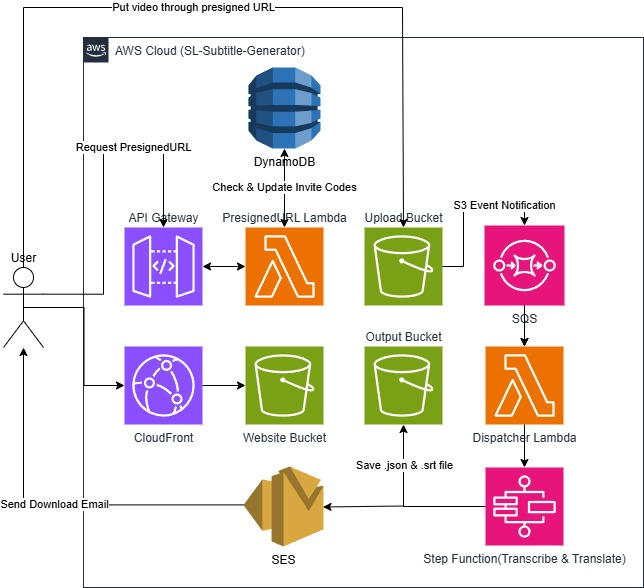
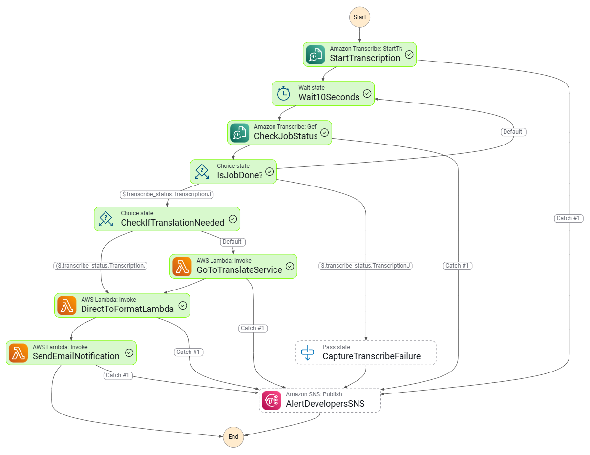

# SL-Subtitle-Generator

 
 

An event-driven, serverless subtitle generation and translation pipeline built on AWS. Designed and implemented as a production-ready proof-of-concept emphasizing security, reliability, and cost efficiency.

**Role:** Sole creator, assisted by Gemini

### Architecture Diagram

### Step Functions Workflow

**Summary**

- **What it does:** Accepts video uploads, transcribes audio, generates SRT subtitles, translates to target languages, and delivers time-coded subtitle files that can be used directly in video editing tools like CapCut.
- **Key constraints addressed:** Large file uploads (presigned S3 URLs), asynchronous processing (SQS + Step Functions), resilient orchestration (Step Functions with retries and error paths), and automated short-term retention (S3 lifecycle rules).
- **Cost control:** Client-side upload validation enforces a 15-second maximum video duration to avoid expensive long transcription jobs.
- **Access flow:** Invite codes are validated in the PresignedURL Lambda via DynamoDB before upload links are issued.

**Selected Highlights**

- **Serverless-first:** AWS Lambda for lightweight microservices and Step Functions for orchestration.
- **Scalable ingestion:** Presigned S3 uploads plus SQS buffering to decouple and smooth traffic.
- **Invite-based access:** DynamoDB stores invite codes and quotas, and the PresignedURL Lambda validates codes and quota before issuing upload links.
- **ML integrations:** Amazon Transcribe for speech-to-text and Amazon Translate for multilingual output.
- **Operational-ready:** IAM roles scoped to service needs, CloudFront fronting the static website, and lifecycle policies for cost control.

**Technical Stack**

- Compute: AWS Lambda, Step Functions
- Storage & Delivery: Amazon S3, CloudFront, DynamoDB
- Messaging & API: Amazon SQS, API Gateway
- ML: Amazon Transcribe, Amazon Translate
- Notifications: Amazon SES

Design notes (concise)

- Invite codes are stored in DynamoDB and checked in the PresignedURL Lambda before issuing upload links; quotas are enforced per code.
- Uploads use UUID-based object naming and presigned POST/PUT URLs to avoid large API payloads.
- S3 event -> SQS -> dispatcher Lambda starts Step Functions executions for robust, idempotent processing.
- Subtitles are emitted in SRT format with intelligent line-wrapping and optional translated variants.

Impact

- Fast experimentation with ML-powered workflows without managing servers.
- Safe-by-default static hosting (CloudFront + OAC) and short-lived retention for cost-sensitive scenarios.

Contact & attribution

- Implemented by Yong Shie Liang — AWS-focused engineering and architecture.
- LinkedIn: www.linkedin.com/in/shie-liang-yong
